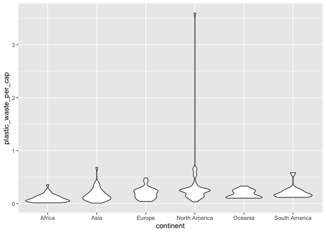

Lab 02 - Plastic waste
================
Fiona Wang
Jan-28-2025

## Load packages and data

``` r
library(tidyverse) 
```

``` r
plastic_waste <- read.csv("data/plastic-waste.csv")
```

## Exercises

``` r
ggplot(data = plastic_waste, aes(x = plastic_waste_per_cap)) + 
  geom_histogram(binwidth = 0.2)
```

<!-- -->

There is one country that stands out, let’s filter to find this country!

``` r
plastic_waste %>%
  filter(plastic_waste_per_cap > 3.5)
```

    ##   code              entity     continent year gdp_per_cap plastic_waste_per_cap
    ## 1  TTO Trinidad and Tobago North America 2010    31260.91                   3.6
    ##   mismanaged_plastic_waste_per_cap mismanaged_plastic_waste coastal_pop
    ## 1                             0.19                    94066     1358433
    ##   total_pop
    ## 1   1341465

It is Trinidad and Tobago from North America. I didn’t expect this
result, mainly because it is a country that I am not familiar with. It
seems like they have high consumption of single-use plastics and limited
recycling infrastructure.

### Exercise 1 Histogram

There weren’t a lot of countries reported on Oceania and South America,
so they seem to have less plastic waste. North America has the outlier
(Trinidad and Tobago). Most countries’ plastic waste per capita is
between 0 to 0.5.The tallest bars among these graphs are 0.0-0.2 and
0.2-0.4.

``` r
ggplot(data = plastic_waste, aes(x = plastic_waste_per_cap, color = continent)) + 
  geom_histogram(binwidth = 0.2) + 
  facet_wrap(~continent, ncol = 3)
```

<!-- -->

Another way of visualizing is using density plots.

``` r
ggplot(data = plastic_waste, aes(x = plastic_waste_per_cap)) + 
  geom_density()
```

<!-- -->

Compare distributions across continent by coloring density curves by
continent.

``` r
ggplot(data = plastic_waste, mapping = aes(x=plastic_waste_per_cap, 
       color = continent)) +
  geom_density()
```

<!-- -->

Fill the curves of the density graph and adjust the transparency.

``` r
ggplot(data = plastic_waste, 
       mapping = aes(x = plastic_waste_per_cap, color = continent,
                     fill = continent)) + 
  geom_density(alpha = 0.7)
```

<!-- -->

### Exercise 2 Recreate density plot

To compare between mapping and setting/geom, I am trying out the
following two ways. First, let’s use geom_density to define color and
fill, and we use mapping to define alpha. The second way is to put color
and fill in mapping while defining alpha in the setting/geom.

``` r
#The first way
ggplot(data = plastic_waste, 
       mapping = aes(x = plastic_waste_per_cap, alpha = 0.1)) + 
  geom_density(color = "pink", fill = "blue")
```

<!-- -->

``` r
#The second way
ggplot(data = plastic_waste, 
       mapping = aes(x = plastic_waste_per_cap, 
                     color = continent, fill = continent)) +
  geom_density(alpha = 0.1)
```

<!-- -->

2.2 answer: As we can see, if we define color and fill in geom_density,
we cannot distinguish between each continent, as this will be a setting
for all of the continents. If we put color and fill in mapping, we can
ask R to map each continent using different colors. For alpha, when I
put it in the mapping, no transparency took place. Also, we want the
same transparency to be applied to each of the continent. This is why we
just define alpha in the setting, so it can be applied globally.

Another way to visualize is using box plots.

``` r
ggplot(data = plastic_waste,
       mapping = aes(x = continent, y = plastic_waste_per_cap)) +
  geom_boxplot()
```

<!-- -->

### Exercise 3 Violin

Both boxplot and violin plot give us outliers. The boxplot gives us the
median and quartiles that a violin plot doesn’t. A violin plot can give
you the distribution of each continent which the boxplot doesn’t.

``` r
ggplot(data = plastic_waste,
       mapping = aes(x = continent, y = plastic_waste_per_cap)) +
  geom_violin()
```

<!-- -->

### Exercise 4 Scatterplot

4.1. In general, it seems like the more plastic waste per capita, the
more mismanaged plastic waste per capita. If there is a linear
relationship, it is a positive one.

``` r
ggplot(data = plastic_waste,
       mapping = aes(x = plastic_waste_per_cap, 
                     y = mismanaged_plastic_waste_per_cap)) +
  geom_point()
```

<!-- -->

4.2. As we see from the plot below, all continent has a positive
relationship between plastic waste per capita and mismanaged plastic
waste per capita. Some have steeper slopes: Asia and Africa, whereas
some have smaller slopes:North America, Europe).

``` r
ggplot(data = plastic_waste, 
       mapping = aes(x = plastic_waste_per_cap,
                     y = mismanaged_plastic_waste_per_cap,
                     color = continent)) +
  geom_point(alpha = 0.5)
```

<!-- -->

4.3. When asked to visualize this relationship, I was originally
thinking that population might affect plastic waste per capita. That’s
why plastic waste per capita is the x variable, and the population
variables are on the y-axis. Both plots don’t appear to be perfect
linear relationships. Comparing these two plots, I would say that the
coastal population plot appears to be more strongly linearly associated.

``` r
ggplot(data = plastic_waste, mapping = aes(x = total_pop,
                                           y = plastic_waste_per_cap)) + 
  geom_point()
```

<!-- -->

``` r
ggplot(data = plastic_waste, mapping = aes(x = coastal_pop,
                                           y = plastic_waste_per_cap)) +
  geom_point()
```

<!-- -->

### Exercise 5

Looking at plot 1 below, the general curve shows that the higher the
proportion (from 0 to 1), the more plastic waste per capita. There is
not much to comment on specific continent, as they are scattered and
hard to keep track of. What’s interesting is that some countries have
proportions that are higher than 1 which is weird.

Looking at plot 2 below, this graph shows the trend of each continent.
All shows a general increase. However, there also seems to be a decrease
in trend for some continents.

``` r
plastic_waste$coastpror = plastic_waste$coastal_pop/plastic_waste$total_pop

ggplot(data = plastic_waste %>%
         filter(plastic_waste_per_cap < 3.5)) + 
         geom_point(aes(x = coastpror, y = plastic_waste_per_cap, color = continent)) + 
  stat_smooth(aes(x = coastpror, y = plastic_waste_per_cap)) + 
         labs(title = "Plastic waste vs. coastal population proportion" , 
                subtitle = "by continent" , 
                x = "Coastal population proportion (Coastal / total population" , 
                y = "Plastic waste per capita" ) 
```

    ## `geom_smooth()` using method = 'loess' and formula = 'y ~ x'

<!-- -->

``` r
ggplot(data = plastic_waste %>%
         filter(plastic_waste_per_cap < 3.5), 
       mapping = aes(x = coastpror, y = plastic_waste_per_cap, color = continent)) +
  geom_point() + stat_smooth() +
         labs(title = "Plastic waste vs. coastal population proportion" , 
                subtitle = "by continent" , 
                x = "Coastal population proportion (Coastal / total population" , 
                y = "Plastic waste per capita" ) 
```

    ## `geom_smooth()` using method = 'loess' and formula = 'y ~ x'

<!-- -->
